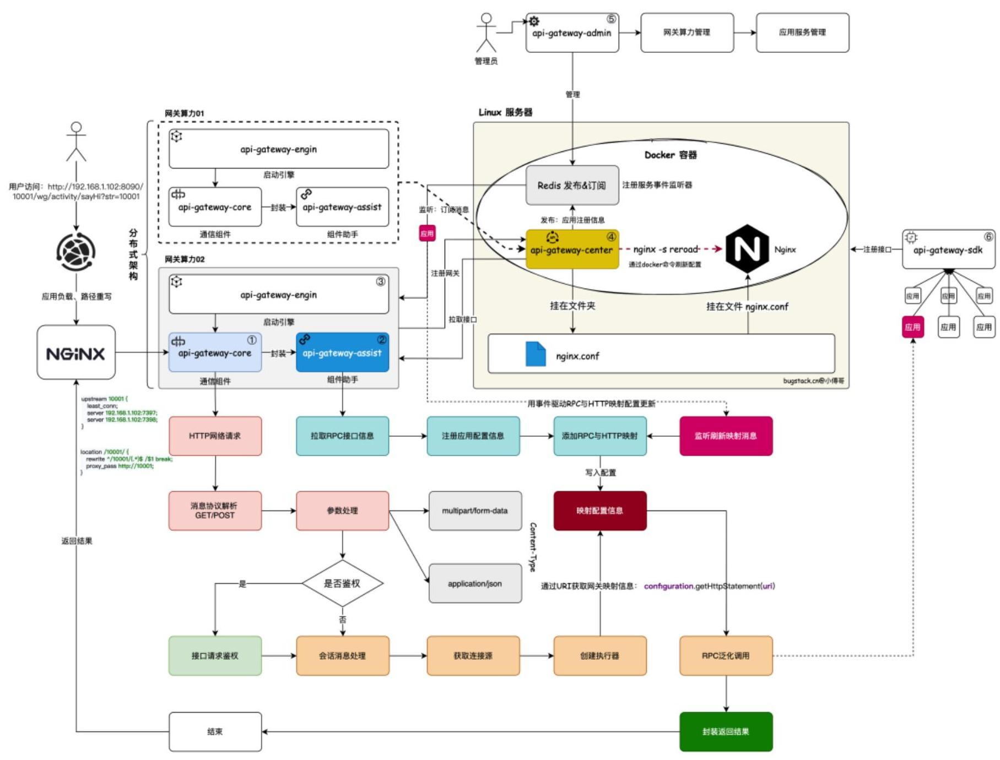

 

本项目由**西北工业大学计算机学院“智能感知与计算工信部重点实验室与陕西省嵌入式系统技术重点实验室**进行设计与开发，主要针对于 **国家重点研发计划“物联网与智慧城市关键技术及示范”** 而进行研发，Gateway是配合着我们自主研发的CrowdOS系统，解决城市群智感知的相关问题。

  

---

**我们整个微服务模块结构如下：**

| 序号 |      系统       |                             描述                             | 完成情况 |
| :--: | :-------------: | :----------------------------------------------------------: | :------: |
|  1   |  gateway-core   | 网关核心系统：用于网络通信转换处理，承接http请求，调用RPC服务，责任链模块调用 |    √     |
|  2   |  gateway-admin  |     网关管理系统：用于网关接口后台管理，注册下线停用控制     |    √      |
|  3   |   gateway-sdk   |     网关注册组件：用于注解方式采集接口，发送消息注册接口     |    √     |
|  4   | gateway-center  |     网关注册中心：提供网关注册中心服务，登记网关接口信息     |    √     |
|  5   | gateway-assist  | 网关服务中心：通信服务组件封装，用于包装gateway-core，通信服务组件封装，让springboot更加容易使用 |     √     |
|  6   | gateway-engine  |         网关引擎工程：将网关打包成jar放到容器中运行          |     √     |
|  7   | gateway-monitor |   网关监控日志：监控日志、生成各种运维管理报表、自动告警等   |          |
|  8   |  gateway-test   |           网关测试中心：对网关的运行进行测试使用的           |    √      |

### 为什么要设计一个网关？

在智任务中，群智任务必然会涉及到高并发，同时上千人或上万人进行一个群智任务，并同时对数据进行处理并返回给用户进行下一阶段群智任务开展。

像京东、阿里、美团都是有自己的API网关的，因为这样可以更好的控制网关和自身系统的结合，也可以添加各类自己需要的功能，以及支撑更大的流量。同时像目前所开源的著名Gateway，例如Spring Cloud Gateway，shenyu等等，为我们提供了研究思路。

为了能够更了解流量输入和针对于不同群智任务的所设计（异常如何处理，多群智任务流量入口如何设计），对此，秉承着**秉承开源精神以及研究者的学习和实践**，**同时为整个国家重点实验室群智计算作出贡献：**

**我们希望能够设计出一款依托于[“群智感知操作系统平台”——CrowdOS]([CrowdOS sensing framework](https://www.crowdos.cn/))**，不断发展，最终成为 **[Apache](https://baike.baidu.com/item/Apache/8512995?fromModule=lemma_inlink)软件基金会的著名项目**

### 设计的理念

1. **轻量化**：能够做到即插即用，而不需要引用过多的组件，降低使用者的学习成本。
2. **高扩展化**：能够快速部署服务，为使用者和研究人员根据不同的群智任务需求进行自定义扩展，使用 SPI 机制进行扩展，同时支持业务使用方的 Plugin 插件扩展。
3. **稳定性：**，在执行群智感知任务的时候，为避免系统崩溃造成执行任务时连接异常，进行了线程隔离、异步请求等处理。
4. **高效性**：在群智任务中，可能会涉及到同时上万个设备进行处理任务，这将带来巨大的负载压力。对此我们做了多网关处理，接入Disruptor处理任务。

同时，CrowdOS-Gateway2.0版本将针对于CrowdOS系统进行升级，以承担起群智任务的流量入口和群智任务的用户数据预处理。

### 系统架构设计

请下载我们的测试项目，以验证各个子模块是否正常运行：https://github.com/JoelEmbiiddddd/CrowdOS-Gateway-Test

## 获得帮助

如果你在使用CrowdOS-Gateway时遇到任何问题，以下内容可能对你有帮助。

- 访问我们的网站[www.crowdos.cn](https://www.crowdos.cn/)。
- 或者给我们发电子邮件[(lixinhuang@mail.nwpu.edu.cn)](lixinhuang@mail.nwpu.edu.cn)。

## 引导

[www.crowdos.cn](https://www.crowdos.cn/)网站包含了CrowdOS的一些细节信息。

## 许可证

CrowdOS-Gateway项目是根据[Apache License](https://www.apache.org/licenses/LICENSE-2.0)的2.0版本发布的。
